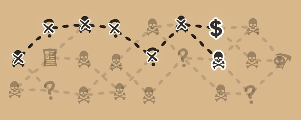
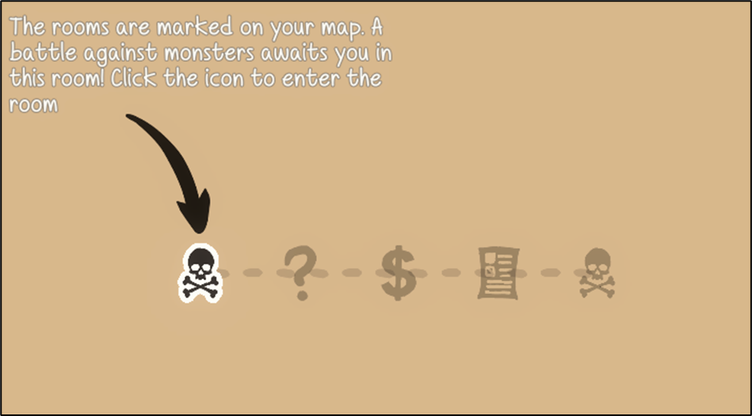

# **Game ReadMe**

## **Overview**
This videogame is a **2D pixel-art roguelike** set in an **Egyptian desert temple** and was created using the **Unity Engine** as part of a university project. The player navigates through **randomly generated levels**, fights against **waves of enemies**, recruits defeated foes, and buys upgrades to build and strengthen their own team. The goal is to **master all rooms and defeat the final boss**.

---
## **Gameplay & Mechanics**

### **Level Structure**
- **Procedurally generated world map** with multiple paths and levels.
- Each room contains **waves of enemies** that must be defeated.
- After each completed room, the player can **strengthen their team** by using collected coins.
- The player **strategically selects** the next room on the world map.

### **Combat System**
- **Manual movement** of the main character with **automatic attacks**.
- **Team members attack enemies independently** and navigate using a **NavMesh pathfinding algorithm**.
- Various **enemy types**, each with unique behavior (speed, strength, health points, ...).
- **Physics-based collision detection** for vision range and obstacles implementation.

### **Upgrades & Team Management**
- Use **coins** from defeated enemies for **upgrades & healing**.
- **Recruit team members** (defeated enemies can become allies).
- Various **upgrade options**:
  - **Health points**
  - **Attack strength**
  - **Defense**
  - **Speed**
  - ...

### **Special Challenges**
- Optional **challenges** that increase difficulty but provide **bonus rewards**:
  - **Darkness**
  - **Faster projectiles**
  - **Explosive traps**
  - **Faster gameplay**
  - **Stronger enemies**

### **Worldmap Events**
- Various events on the worldmap with positive and negative effects

### **Graphics & Sound**
- **2D pixel graphics** with **normal maps** for depth effects.
- **Dynamic lighting** with light sources & flicker effects.
- **Egyptian-inspired music & sound effects** to enhance atmosphere.

---
## **Goal of the Game**
The game ends when the player **loses all life points** or **defeats the final boss**. Success requires **strategic planning** and **clever use of upgrades and team members**.

---
## **Screenshots**

### **Worldmap**

### **Level Overview**

### **Level Enter**

### **Level HUD**

### **Enemies**

### **Shop**

### **Challenge Board**

### **Challenge Darkness**

### **Challenge Traps**

### **Worldmap Events**

### **Tutorial**

### **Normal Maps vs. no Normal Maps**

### **Internal NavMesh**

